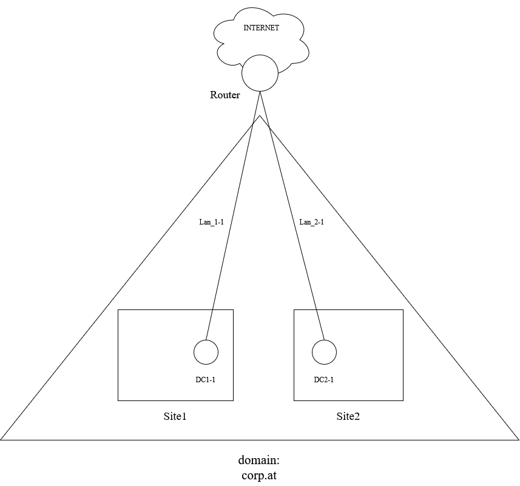
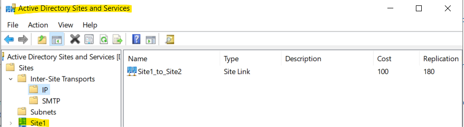
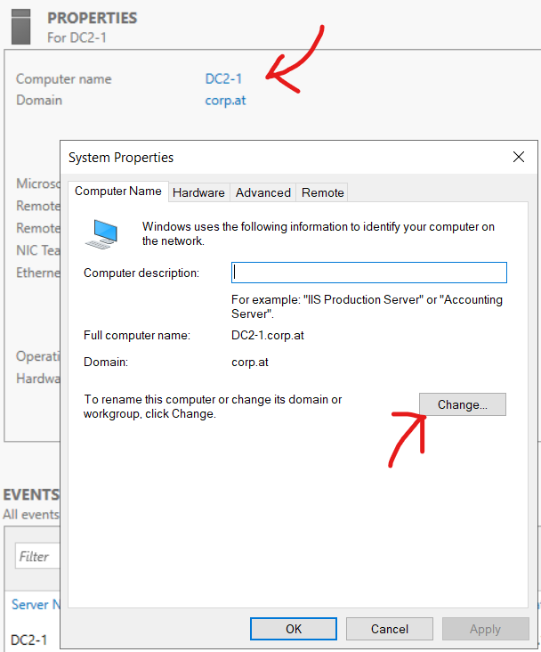
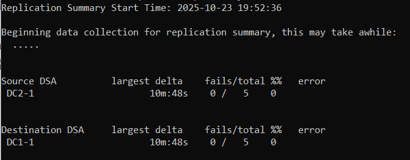
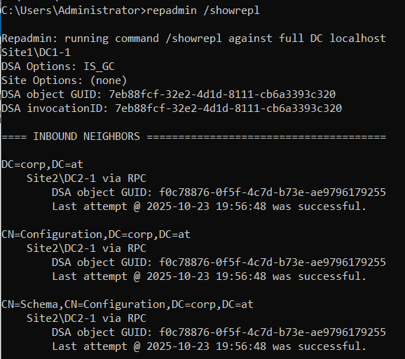

# BS1.1

## TOPO


## Plan
zuerst DC1-1 konfigureiren. dann DC2-1 konfigurieren. 


# Domain **corp.at**
Domain: **corp.at**


## DC1-1
| interface    | ip          | lan segment|
| ------------ | ----------- | ---------- |
| Ethernet1    | 192.168.1.1 | Lan_1-1    |
| NAT-Interface| DHCP        | - |

- ### Konfiguration
    - in VM-ware ein neue netztkarte im Lan_1.1
    - Server Umbenenen: **DC1-1**
    - IP Addressen setzen und NIC's umbenenen (wie in den Tabellen beschrieben)
    - Windows Rollen instalieren:
        - Active Directory Domain Services **(AD DS)**
        - (dienste wie DNS werden bei der Hochstuffung zu einem Domain-Controler instaliert)
    - features instalieren 
    - DC1-1 auf einen Domaincontroler UPGRADEN
        - (DC1-1 ist primary DC da er der ERSTE in der Domain war)
    - DC1-1 zu DC hochstufen und **Neustarten**
- #### neue Site hinzufügen
    - Active Directory Sites & services öffnen
    

    - Sites und Site-Links **umbenenen** (im bild sind die sites und site links schon umbenannt)
    - eine neue Site (Site2) erstellen und den umbenannten site link auswählen (in dem man "Sites" rechtsclickt)

    
    


    


## DC2-1
| interface | ip          |lan segment|
| --------- | ----------- |-----------|
| Ethernet1 | 192.168.2.1 | Lan_2-1|
|NAT-Interface|DHCP|-|

- ### Konfiguration
    - in VM-ware ein neue netztkarte im Lan_2.1
    - Server Umbenenen: **DC2-1**
    - IP Addressen setzen und NIC's umbenenen (wie in den Tabellen beschrieben)
    - Windows Rollen instalieren:
        - Active Directory Domain Services **(AD DS)**
        - (dienste wie DNS werden bei der Hochstuffung zu einem Domain-Controler instaliert)
    - features instalieren 
    - bevor wir DC2-1 zu einem domaincontroler in der Domain **corp.at** in site2 machen können müssen DC1-1 und DC2-1 konektivität miteinander haben.->
    [Router aufsetzen](#router-ubuntu-mit-gui)
## DC2-1 nach Router konfiguration
- *nat immernoch aus*->
    - DC2-1 in domain einbinden
    
    
    *im Bild ist DC2-1 schon in "corp.at" eingebunden.*

    - Credentials: ```corp\administrator``` und dein passwort (```corp\``` ist das prefix von der domain)
    - nachdem DC2-1 in der domain ist ihn zu einem DC aufstufen!
    -[Testen ob replikation funktioniert!](#testen)

    


## Router (Ubuntu mit GUI)
wir benutzen eine Ubuntu VM als router 

| interface | ip          |lan segment|
| ---------  | ------------- |-----------|
| ens37      | 192.168.1.254 | Lan_1-1|
| ens38      | 192.168.2.254 | Lan_2_1|
| ens33 (NAT)| DHCP |-|

- ### Konfiguration
    - IP-Konfiguration wie in der Tabelle beschrieben (mit der GUI oder mit anderen tools Bsp. netplan. Je nach distro kann der Interfacename schwanken!)
    - testen ob man die DC's pingen kann. **WICHTIG:** am besten alle nat interfaces ausschalten damit auch sicher keine anderen IP's für die Pings verwendet werden **UND** Die firewalls entweder anpassen oder ausschalten damit der Ping nicht blockiert wird! (auf allen geräten incl. Router)
    - Routing aktivieren:
        - ```sudo nano /etc/sysctl.conf```
        
            in dieser file die Zeile:

            ```#net.ipv4.ip_forward=1```

            zu dieser machen:

            ```net.ipv4.ip_forward=1``` *einfach das <#> weg machen*
            
            änderungen speichern und änderungen aktivieren mit folgendem command:
        - ```udo sysctl -p``` 
    
    - testen ob DC1-1 und DC2-1 sich pingen können
    - wenn ja -> [DC2-1 weitermachen](#dc2-1-nach-router-konfiguration)


## Testen
- ## Replikation Testen
    - ```repadmin /replsummary```
    

    Bild zeigt eine zusammenfassung der replikationen an auf DC1-1

    - ```repadmin /showrepl```
    

    Bild zeigt eine zusammenfassung der letzen replikationen an und ob diese versuche gelungen sind oder nicht


# Quellen
[Microsoft MULTI-SITE](https://learn.microsoft.com/en-us/windows-server/remote/remote-access/ras/multisite/configure/configure-a-multisite-deployment)


