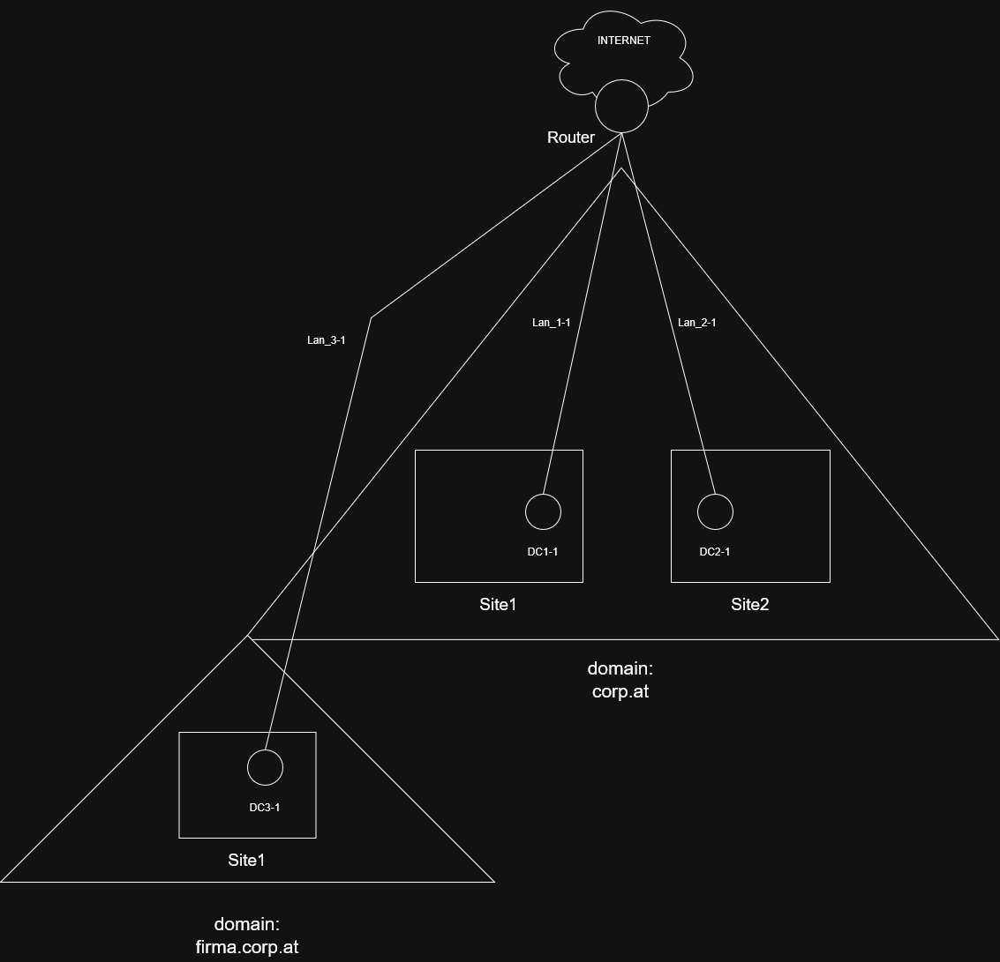
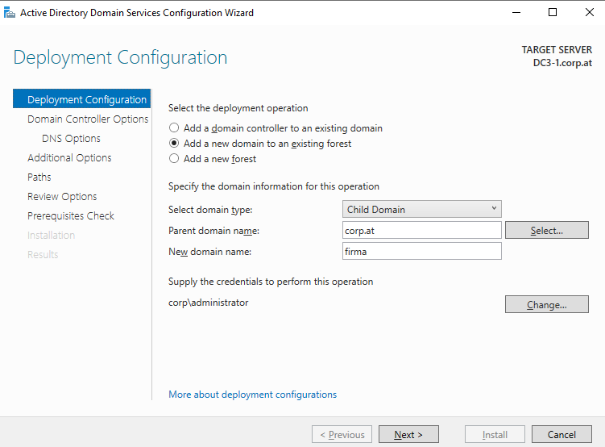
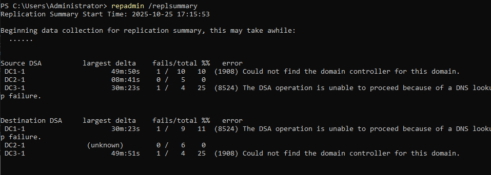
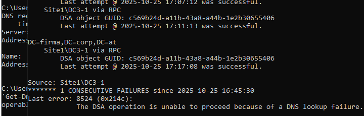
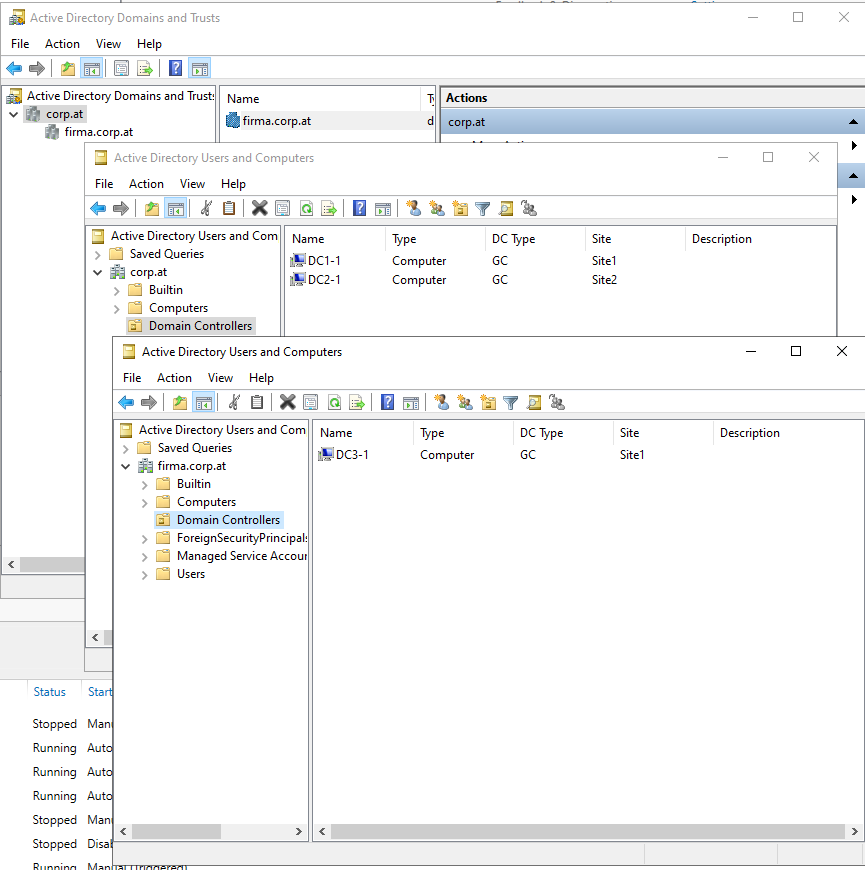

# BS1.2

## TOPO


## Plan
auf [BS1.1](../BS1.1/BS1.1.md) aufbauend.

wir werden zu der domain **corp.at** eine subdomain **firma.corp.at** hinzufügen mit einem neuen DC namens ["DC3-1"](#dc3-1)


# Domain **corp.at**
Domain: **corp.at**

Sub-Domain: **firma.corp.at**
- DC3-1 wird der DC in dieser sub-domain


## DC3-1
| interface    | ip          | lan segment|
| ------------ | ----------- | ---------- |
| Ethernet1    | 192.168.3.1 | Lan_3-1    |
| NAT-Interface| DHCP        | - |

- ### Konfiguration
    - in VM-ware ein neue netztkarte im Lan_3-1
    - Server Umbenenen: **DC3-1**
    - IP Addressen setzen und NIC's umbenenen (wie in den Tabellen beschrieben)
    - Windows Rollen instalieren:
        - Active Directory Domain Services **(AD DS)**
        - (dienste wie DNS werden bei der Hochstuffung zu einem Domain-Controler instaliert)
    - features instalieren
    - [router konfigurieren](#router-ubuntu-mit-gui) bevor man weitermachen kann

- ### nach router konfiguration
    - DC1-1 als dns server auf DC3-1 eintragen
    - DC3-1 in die domain corp.at einbinden *(das macht man dort wo auch der computername gesetzt wird)*
    
        jetzt sollten sich DC1-1 und DC3-1 sich gegenseitig via hostnamen pingen/nslookup können
    - DC3-1 zu einem Domaincontroler upgraden:

    

    - die option *"Add a new doamin to an existing forest"* auswählen.
    - die credentials ändern auf ```user: corp\administrator``` und das password angeben
    - auf den *select* button bei "*parent domain name*" clicken. Die domain sollte aufpoppen und automatisch in das feld eingetragen werden
    - jetzt nur noch den child namen *(new domain name)* angeben und auf next
    - hier die **site** auswählen (was das macht noch hinzufügen)
    - wizzard abschließen und instalieren.

- ### jetzt nur noch [TESTEN](#testen)

    


## Router (Ubuntu mit GUI)
wir benutzen die Ubuntu VM aus [BS1.1](../BS1.1/BS1.1.md) als router. wir fügen nur ein neues interface hinzu. 

| interface | ip          |lan segment|
| ---------  | ------------- |-----------|
| ens37      | 192.168.1.254 | Lan_1-1 |
| ens38      | 192.168.2.254 | Lan_2_1 |
| **ens39**      | **192.168.3.254** | **Lan_3_1** |
| ens33 (NAT)| DHCP |-|


- ### Konfiguration
    - IP-Konfiguration wie in der Tabelle beschrieben (mit der GUI oder mit anderen tools Bsp. netplan. Je nach distro kann der Interfacename schwanken!)
    - testen ob man die DC's pingen kann. **WICHTIG:** am besten alle nat interfaces ausschalten damit auch sicher keine anderen IP's für die Pings verwendet werden **UND** Die firewalls entweder anpassen oder ausschalten damit der Ping nicht blockiert wird! (auf allen geräten incl. Router)

    ***(folgende Konfiguration nur notwendig falls [BS1.1](../BS1.1/BS1.1.md) nicht gemacht wurde)***

    - Routing aktivieren:
        - ```sudo nano /etc/sysctl.conf```
        
            in dieser file die Zeile:

            ```#net.ipv4.ip_forward=1```

            zu dieser machen:

            ```net.ipv4.ip_forward=1``` *einfach das <#> weg machen*
            
            änderungen speichern und änderungen aktivieren mit folgendem command:
        - ```sudo sysctl -p``` 
    
    - testen ob DC3-1 und DC1-1 sich pingen können
    - wenn ja -> [DC3-1 weitermachen](#nach-router-konfiguration)


## Testen
- ## Replikation Testen
    - ```repadmin /replsummary```
  
    

    Bild zeigt eine zusammenfassung der replikationen an auf DC1-1

    - ```repadmin /showrepl```

    

    Bild zeigt eine zusammenfassung der letzen replikationen an und ob diese versuche gelungen sind oder nicht

- ## ```active directory domains and trusts```
        
    in **active directory domains and trusts** sieht man die subdomain

    